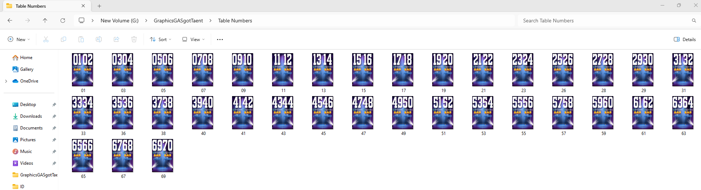

# Photoshop Automation Task

This repository shows a Photoshop automation task that I completed. The task involved automating the process of saving a series of images with sequential numbers and specific text layers, using Adobe Photoshop.

## Overview

In this project, I used with a Photoshop document (PSD file) that served as an Table Number template for an event, which I also designed. The objective was to save a total of 70 PNG images, each with a unique number (sequential 01-70) and specific text layers.

## Goals

The primary goals of this task were as follows:
- Automate the process of saving 70 PNG images.
- Assign sequential numbers to the saved images (01, 02, 03, and so on).
- Incorporate these numbers into specific text layers within each image.
- Ensure that the numbers progress in increments of two per image (e.g., 01, 02, 03, etc.).

## How It Works

To achieve these goals, I utilized the following steps:
1. Opened the provided PSD file in Photoshop.
2. Ensured that the text layers within the PSD file were properly labeled, including layers named "1st" and "2nd."
3. Wrote a JavaScript script to automate the process.The script iterated through a loop, updating text layers with sequential numbers and saving corresponding PNG files. The script accounted for the requirement of numbers progressing by two, ensuring that the output was in the format "01(1st text layer), 02(2nd text layer)," "03(1st text layer), 04(2nd text layer)," and so on. The resulting PNG images were saved with leading zeros (e.g., "01," "02") for consistency.
4. To run the script in Adobe Photoshop I went  to File > Scripts > Browse... to open the Scripts dialog, and ran the automateSave.js script.

## Code

The code used for this automation task is available in this repository. The JavaScript script that was created to accomplish this task.

## Project Files

- `automateSave.js`: The JavaScript script used for automation.
- `table_number_design.png`: The design of the table number.
- `table_number.psd`: The Photoshop file used in the task.
- `screenshot_output.png`: A screenshot showing the output with 35 generated images.

## Conclusion

This Photoshop automation project not only achieved the desired results but also showcased my problem-solving skills and ability to use scripting to streamline tasks. I'm excited to share this task as an example of my automation capabilities.

Thank you for considering my contribution.

---

*Sophia Nicole Garcia*
